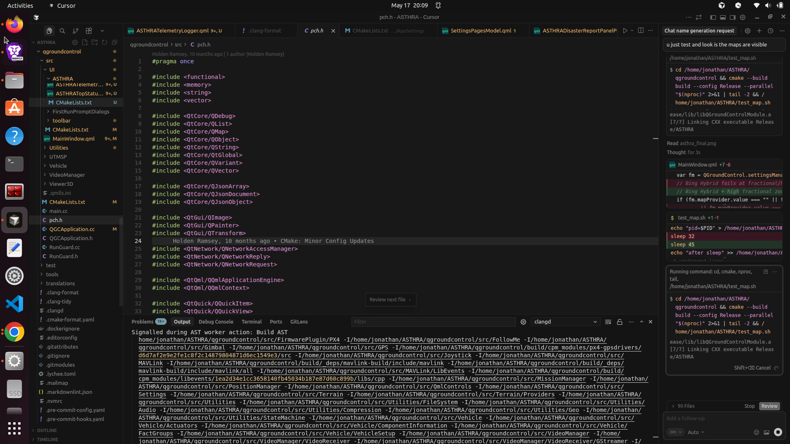

# ASTHRA

Ground control for humanitarian and industrial UAV operations.

ASTHRA (Advanced Strategic Tactical Humanitarian Response Analyser) is a Qt 6 / MAVLink ground station for **one drone or a coordinated fleet**. Each USB radio is a first-class vehicle. Operators load a KML polygon, assign coverage by percent, then split, survey, and upload—without the GCS ever auto-arming.

Forked from [QGroundControl](https://github.com/mavlink/qgroundcontrol).

[](#)
[](LICENSE-GPL)

<p align="center">
  
</p>

---

## Capabilities

| Area | Behaviour |
|------|-----------|
| Fleet identity | One Pixhawk USB cable = one drone, including two boards that share SYSID 2 |
| USB hygiene | Composite extra interfaces on the same board are ignored |
| Land split | KML first, operator percents that total 100%, then map split |
| Survey | Per-drone lawnmower waypoints, upload to the matching vehicle |
| Cockpit | Map and telemetry stay visible beside the swarm panel |
| Safety | ASTHRA does not arm. Arm from the vehicle panel when you intend to fly |

---

## Swarm workflow


1. Connect each flight controller by USB.
2. Launch ASTHRA and open **SWARM**.
3. Load the land **KML**.
4. Set each drone’s **percent** (sum must be 100).
5. **Draw split on map**, generate surveys, **upload**.
6. Arm only when the aircraft and battery are actually ready.

Autopilot PreArm text (battery, GPS) is from the flight controller, not a failed GCS link.

---

## Build and run (Linux)

Requires Qt 6 and a graphical session.

```bash
./run_asthra.sh --build
```

Already built:

```bash
./run_asthra.sh
```

Artifact: `build/Release/ASTHRA`

Fleet logic (no hardware):

```bash
python3 tools/tests/test_asthra_fleet.py
```

---

## Repository map

| Path | Role |
|------|------|
| `run_asthra.sh` | Build and launch |
| `src/UI/ASTHRA/` | Swarm UI, telemetry column, status strip |
| `src/Comms/` | Serial radios, one vehicle per cable |
| `src/Vehicle/` | Multi-vehicle manager |
| `tools/tests/test_asthra_fleet.py` | Split and identity tests |
| `docs/` | Product media and upstream QGC guides |

---

## License

Dual-licensed with QGroundControl: [GPL-3.0](LICENSE-GPL) and [Apache-2.0](LICENSE-APACHE). Preserve those notices in derivatives.

Upstream: [mavlink/qgroundcontrol](https://github.com/mavlink/qgroundcontrol)
